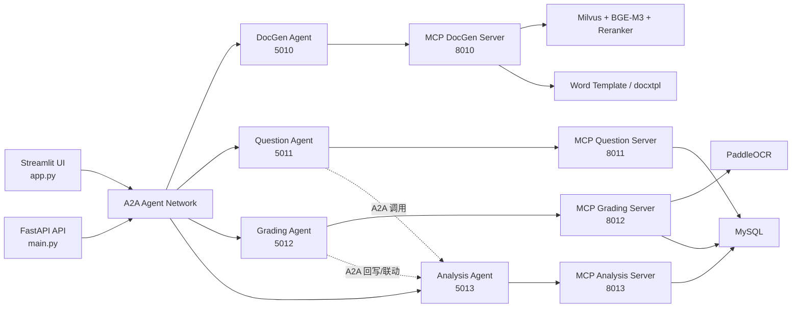

# EnglishTeachingAssistant

一个以 Agent 开发为中心的英语教学助手项目，围绕 `教案生成`、`智能出题`、`作业批改`、`学情分析` 四类能力，搭建了一个 `A2A + MCP` 的多智能体协作系统。

这个项目的重点不只是“调用 LLM 完成功能”，而是把不同职责拆成独立 Agent，再通过 A2A 做任务编排，通过 MCP 暴露工具能力，让 Agent、工具层、数据层之间保持清晰边界。

## 项目定位

- 面向英语教学场景的多 Agent 应用
- 采用 `Agent as Service` 的结构，每个 Agent 都可独立启动、独立测试、独立扩展
- 采用 `MCP Tool Server` 承载 OCR、RAG、数据库读写、文档生成等工具能力
- 支持从前端对话入口一路路由到 Agent，再下钻到 MCP 工具调用

## 系统总览



## 核心 Agent

### 1. DocGen Agent

- 位置：`a2a_server/docgen_server.py`
- 职责：接收教案生成任务，解析年级、单元、主题等参数，调用 MCP 检索教材内容，再触发教案生成与 Word 导出
- 特点：把“教学请求理解”和“工具调用流程编排”放在 Agent 层，把检索、生成、导出放在 MCP 层

### 2. Question Agent

- 位置：`a2a_server/question_server.py`
- 职责：生成题目、查询知识点、按薄弱点定向出题
- 特点：除了调用题库 MCP，还会通过 A2A 调用学情分析 Agent，拿到学生薄弱点后再做个性化出题

### 3. Grading Agent

- 位置：`a2a_server/grading_server.py`
- 职责：作业图片批改、OCR 识别、答案比对、成绩汇总、结果落库
- 特点：先调用批改 MCP 做 OCR 和答案处理，再通过 A2A 把批改结果通知学情分析 Agent，形成闭环

### 4. Analysis Agent

- 位置：`a2a_server/analysis_server.py`
- 职责：学生薄弱点分析、学情数据汇总、班级分析、批改结果入库后的二次加工
- 特点：是整个系统的“教学反馈中心”，既能被前端直接调用，也能被其他 Agent 作为下游能力复用

## 多 Agent 编排设计

这个项目的编排思想是：`Agent 负责决策与流程，MCP 负责工具与执行，数据层负责事实来源`。

### 编排入口

- `app.py` 提供 Streamlit 对话界面，同时维护 `AgentNetwork`
- `main.py` 提供 FastAPI 后端入口，执行意图识别、Agent 路由、结果汇总
- 两个入口都会把用户请求转成 A2A 任务，而不是直接在界面层堆业务逻辑

### 编排流程

1. 前端或 API 接收自然语言请求
2. `ChatOpenAI` 完成意图识别与查询改写
3. 根据意图映射到目标 Agent
4. Agent 解析请求，决定调用哪些 MCP 工具
5. MCP 返回结构化结果
6. Agent 对结果做业务拼接、总结或再次路由
7. 必要时 Agent 之间再通过 A2A 协同

### 为什么这样分层

- 避免把 OCR、数据库、RAG、Word 生成这类“工具代码”混进 Agent 推理逻辑
- 让每个 Agent 能聚焦单一业务角色，便于维护和扩展
- 让工具能力以 MCP 形式标准化，便于替换实现或复用
- 让 Agent 之间保持服务级边界，后续更容易扩成分布式部署

## A2A 在这个项目里解决什么问题

项目中的 A2A 不是装饰层，而是实际的多 Agent 编排骨架。

### A2A 的使用方式

- 使用 `python-a2a` 作为协议和运行时实现
- 每个 Agent 都通过 `A2AServer` 启动为独立服务
- Agent 通过 `AgentCard` 和 `AgentSkill` 暴露自身能力描述
- 上层通过 `AgentNetwork` 或 `A2AClient` 调用目标 Agent
- 请求以 `Message`、`Task`、`TaskStatus`、`TaskState` 的形式流转

### A2A 的价值

- 把单体式“函数调用”升级为“可发现、可描述、可组合”的 Agent 服务
- 支持 Agent 之间直接互调，而不是所有流程都塞回主控层
- 让超时、重试、状态返回等协作细节落在协议层处理
- 为后续增加更多教学 Agent 留下标准扩展位

### 当前项目里的典型 A2A 协作

- `Question Agent -> Analysis Agent`
  用于根据学生薄弱点生成针对性练习
- `Grading Agent -> Analysis Agent`
  用于在批改完成后同步结果，更新学情数据
- `UI/API -> 各业务 Agent`
  统一通过 A2A 发任务，而不是直接耦合内部实现

## MCP 在这个项目里解决什么问题

项目中的 MCP 层承担的是“工具服务器”角色，让 Agent 可以通过统一协议调用底层能力。

### MCP Server 划分

- `mcp_server/mcp_docgen_server.py`
  负责教材检索、教案生成、Word 导出
- `mcp_server/mcp_question_server.py`
  负责题库检索、知识点查询、作业保存
- `mcp_server/mcp_grading_server.py`
  负责 OCR、标准答案查询、答案比对、提交记录、结果保存
- `mcp_server/mcp_analysis_server.py`
  负责薄弱点查询、学情数据获取、成绩分析、Text-to-SQL

### MCP 的实现特征

- 使用 `mcp` Python SDK 实现工具协议
- 每个 MCP Server 通过 `Server(...)` 注册工具
- 通过 `@server.list_tools()` 暴露工具元数据
- 通过 `@server.call_tool()` 执行工具逻辑
- 通过 `SseServerTransport` 提供基于 SSE 的远程访问
- Agent 侧通过 `mcp.client.sse.sse_client` 和 `ClientSession` 发起调用

### 为什么 MCP 适合这个项目

- 工具层天然适合抽成标准接口，比如 `search_textbook`、`ocr_recognize`、`save_grading_result`
- Agent 无需关心具体工具内部实现，只需关心何时调用、如何编排
- 让 RAG、OCR、DB、文档生成这些底层能力统一接入
- 后续替换工具实现时，不需要整体改 Agent 协调逻辑

## 核心技术栈

下面这部分是这个项目真正的“Agent 技术底盘”。

### Agent 编排与协议层

- `python-a2a`
  多 Agent 服务注册、消息发送、任务管理、AgentCard/Skill 描述
- `mcp`
  工具协议定义、Tool 暴露、SSE 传输、客户端会话管理
- `httpx`
  底层网络请求支持

### LLM 与提示工程

- `langchain-openai`
  以 OpenAI 兼容方式接入模型
- `ChatOpenAI`
  用于意图识别、教案生成、业务推理
- `DashScope / Qwen`
  通过 `base_url` 兼容 OpenAI 接口接入 `qwen3-max`
- `main_prompts.py`
  放置意图识别与主控提示词模板

### RAG 与检索层

- `FlagEmbedding`
  提供 `BGE-M3` 稠密/稀疏混合向量能力
- `pymilvus`
  向量数据库访问
- `BGE-M3`
  第一阶段混合召回
- `BGE-Reranker-Large`
  第二阶段精排
- `utils/milvus_client.py`
  向量检索封装
- `utils/embedding_service.py`
  Embedding 服务封装
- `scripts/build_textbook_index.py`
  教材切块与索引构建流程

### OCR 与图像批改

- `PaddleOCR`
  中文作业识别核心引擎
- `Pillow`
  图片预处理、方向修正、尺寸缩放
- `pdf2image`
  PDF 转图片支持
- `mcp_server/mcp_grading_server.py`
  将 OCR 能力封装为 MCP 工具

### 数据与分析层

- `MySQL`
  存储作业模板、标准答案、提交记录、批改结果、学情数据
- `SQLAlchemy`
  数据访问封装
- `PyMySQL`
  MySQL 驱动
- `utils/db_helper.py`
  供 MCP 工具层复用的数据接口

### 文档生成层

- `docxtpl`
  基于 Word 模板渲染教案
- `python-docx`
  模板缺失时的程序化文档生成兜底
- `templates/lesson_plan_template.docx`
  教案模板
- `utils/word_generator.py`
  文档生成封装

### Web 与交互层

- `Streamlit`
  对话式教学助手前端
- `FastAPI`
  后端 API 与路由入口
- `uvicorn`
  服务运行容器
- `pydantic`
  请求模型定义

## 目录结构

```text
EnglishTeachingAssistant/
├─ app.py                        # Streamlit 前端与 AgentNetwork 入口
├─ main.py                       # FastAPI 后端主控入口
├─ config.py                     # 模型、端口、数据库、OCR、Milvus 配置
├─ main_prompts.py               # 提示词模板
├─ a2a_server/                   # 4 个业务 Agent 服务
├─ mcp_server/                   # 4 个 MCP Tool Server
├─ utils/                        # OCR、RAG、DB、Word 等工具封装
├─ scripts/                      # 索引构建与端到端测试脚本
├─ templates/                    # Word 模板与文本模板
├─ tests/                        # 补充测试
└─ 整个项目思路/                  # 架构说明与设计草稿
```

## 典型调用链

### 教案生成

`用户请求 -> DocGen Agent -> search_textbook(MCP) -> generate_lesson_plan(MCP) -> Word 导出 -> 返回文档路径`

### 智能出题

`用户请求 -> Question Agent -> Analysis Agent(A2A, 可选) -> search_questions(MCP) -> 组装题目结果`

### 作业批改

`图片上传 -> Grading Agent -> ocr_recognize(MCP) -> get_standard_answers(MCP) -> compare_answers(MCP) -> save_grading_result(MCP) -> Analysis Agent(A2A)`

### 学情分析

`用户请求 -> Analysis Agent -> query_weak_points / get_class_analysis / text_to_sql(MCP) -> 返回分析结论`

## 为什么这个项目适合做 Agent 开发样板

- 业务角色拆分明确，容易看清“一个 Agent 应该负责什么”
- A2A 与 MCP 各司其职，边界清楚
- 同时覆盖了 `LLM推理`、`工具调用`、`多 Agent 协作`、`RAG`、`OCR`、`结构化存储`
- 既有实时对话入口，也有独立服务入口，便于本地调试和后续部署

## 本地开发说明

### 1. 安装依赖

```bash
pip install -r requirements.txt
```

### 2. 配置环境变量

复制 `.env.example` 为 `.env`，至少补齐以下配置：

- `DASHSCOPE_API_KEY`
- `DB_HOST` `DB_PORT` `DB_USER` `DB_PASSWORD` `DB_NAME`
- `MILVUS_HOST` `MILVUS_PORT` `MILVUS_COLLECTION`
- `EMBEDDING_MODEL` `RERANKER_MODEL`
- `OCR_DET_MODEL_DIR` `OCR_REC_MODEL_DIR` `OCR_CLS_MODEL_DIR`

### 3. 启动依赖服务

- MySQL
- Milvus
- PaddleOCR 所需模型目录

### 4. 启动 Agent 与 MCP 服务

可参考：

- `start_all.bat`
- `restart_all_services.bat`
- `start_streamlit.ps1`

也可以逐个启动：

```bash
python mcp_server/mcp_docgen_server.py
python mcp_server/mcp_question_server.py
python mcp_server/mcp_grading_server.py
python mcp_server/mcp_analysis_server.py

python a2a_server/docgen_server.py
python a2a_server/question_server.py
python a2a_server/grading_server.py
python a2a_server/analysis_server.py

python app.py
```
