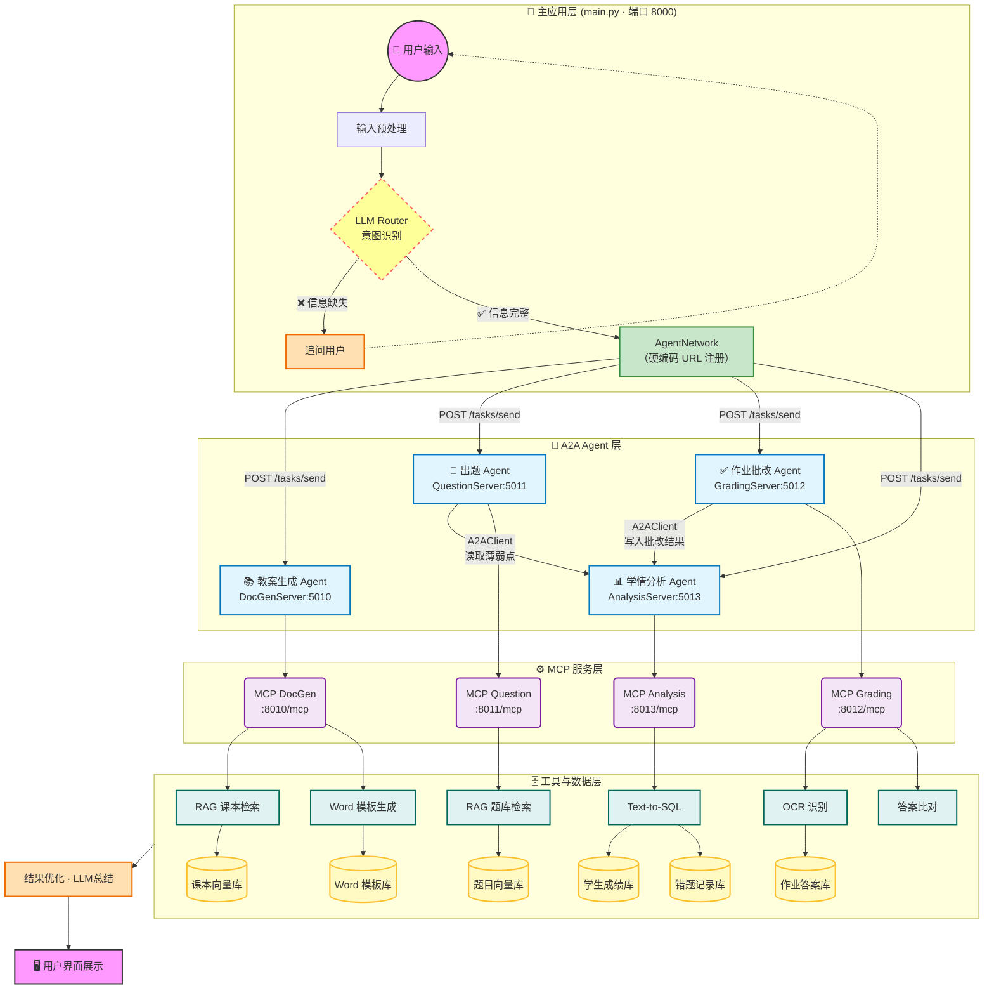
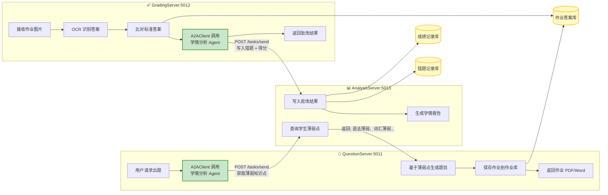
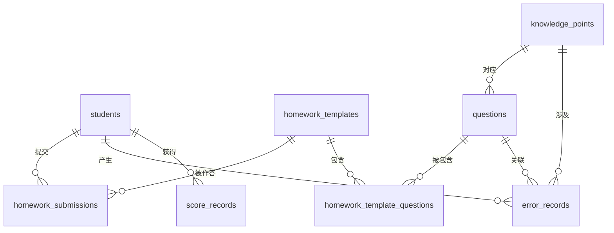

# 英语老师教学助手 - 系统架构设计文档

> 基于 Agent2Agent (A2A) 与 MCP (Model Context Protocol) 的智能英语教学助手系统

---

## 一、系统概述

英语教学助手是一个基于多智能体协作的教学辅助系统。用户通过自然语言提出需求，系统进行意图识别后，将请求路由到对应的专业 Agent（教案生成、出题、作业批改、学情分析），各 Agent 通过 A2A 协议相互协作，并调用 MCP 工具访问数据库或外部 API，最终将结果汇总返回给用户。

### 核心设计原则

1. **硬编码 URL 注册**：采用与 SmartVoyage 项目相同的 A2A 通信模式，各 Agent 通过固定 URL 注册到 `AgentNetwork`
2. **意图识别层 A2A 通信**：主应用的意图识别模块通过 A2A 协议与下游 Agent 通信
3. **Agent 间 A2A 协作**：出题、批改、学情分析三个 Agent 之间通过 A2A 实现数据流转

---

## 二、系统整体架构图



---

## 三、A2A 通信机制详解

### 3.1 硬编码 URL 注册方式（与 SmartVoyage 一致）

```python
# main.py - 初始化系统
def initialize_system():
    global agent_network, llm, agent_urls
    
    # 存储代理 URL 信息（硬编码）
    agent_urls = {
        "DocGenAssistant": "http://localhost:5010",      # 教案生成
        "QuestionAssistant": "http://localhost:5011",    # 出题
        "GradingAssistant": "http://localhost:5012",     # 作业批改
        "AnalysisAssistant": "http://localhost:5013"     # 学情分析
    }
    
    # 创建代理网络并注册所有 Agent
    network = AgentNetwork(name="英语教学助手网络")
    network.add("DocGenAssistant", "http://localhost:5010")
    network.add("QuestionAssistant", "http://localhost:5011")
    network.add("GradingAssistant", "http://localhost:5012")
    network.add("AnalysisAssistant", "http://localhost:5013")
    agent_network = network
```

### 3.2 意图识别到 Agent 的 A2A 调用流程

```python
# main.py - 处理用户输入
def process_user_input(prompt):
    # 1. 意图识别
    intents, user_queries, follow_up = intent_agent(prompt)
    
    for intent in intents:
        # 2. 意图 → Agent 名称映射
        if intent == "lesson_plan":
            agent_name = "DocGenAssistant"
        elif intent == "question":
            agent_name = "QuestionAssistant"
        elif intent == "grading":
            agent_name = "GradingAssistant"
        elif intent == "analysis":
            agent_name = "AnalysisAssistant"
        
        # 3. 从 AgentNetwork 获取 Agent (A2AClient)
        agent = agent_network.get_agent(agent_name)
        
        # 4. 构建 Task 并通过 A2A 协议发送
        message = Message(content=TextContent(text=query), role=MessageRole.USER)
        task = Task(id="task-" + str(uuid.uuid4()), message=message.to_dict())
        
        # 5. 异步发送任务，等待响应
        response = asyncio.run(agent.send_task_async(task))
```

### 3.3 各 Agent 端口分配

| Agent 名称 | 端口 | 职责 | A2A 端点 |
|-----------|------|------|----------|
| **主应用 (main.py)** | 8000 | 意图识别 + 路由 + 结果汇总 | - |
| **DocGenAssistant** | 5010 | 教案生成 | `/a2a/tasks/send` |
| **QuestionAssistant** | 5011 | 智能出题 | `/a2a/tasks/send` |
| **GradingAssistant** | 5012 | 作业批改 | `/a2a/tasks/send` |
| **AnalysisAssistant** | 5013 | 学情分析 | `/a2a/tasks/send` |

| MCP 服务 | 端口 | 职责 |
|----------|------|------|
| MCP DocGen | 8010 | 课本检索 + Word生成工具 |
| MCP Question | 8011 | 题库检索工具 |
| MCP Grading | 8012 | OCR + 答案比对工具 |
| MCP Analysis | 8013 | Text-to-SQL 查询工具 |

---

## 四、三个核心 Agent 的 A2A 协作详解

### 4.1 协作关系概述

**出题 Agent**、**作业批改 Agent**、**学情分析 Agent** 三者形成一个**闭环数据流**：

```
出题 Agent ←── 读取薄弱点 ─── 学情分析 Agent ←── 写入批改结果 ─── 作业批改 Agent
    │                              ↑                                    │
    │                              │                                    │
    └──────── 生成作业 → 学生作答 → 作业图片 ────────────────────────────┘
```

### 4.2 三 Agent 协作架构图



### 4.3 详细 A2A 调用流程

#### 场景 1：智能出题（基于学情）

```
用户: "给张三出一套英语语法练习题"

[QuestionServer:5011]
    │
    ├─1. 提取学生ID和题目类型
    │
    ├─2. 创建 A2AClient 连接学情分析 Agent
    │   self.analysis_client = A2AClient("http://localhost:5013")
    │
    ├─3. 构建 Task 请求薄弱点
    │   message = Message(content=TextContent(
    │       text="查询学生张三的语法薄弱知识点"
    │   ), role=MessageRole.USER)
    │   task = Task(id="task-xxx", message=message.to_dict())
    │
    ├─4. 发送 A2A 请求
    │   result = asyncio.run(self.analysis_client.send_task_async(task))
    │   # 返回: {"weak_points": ["定语从句", "虚拟语气", "时态混用"]}
    │
    ├─5. 基于薄弱点从题库 RAG 检索相关题目
    │   → 调用 MCP Question Server (8011)
    │
    └─6. 组装试卷并返回
```

#### 场景 2：作业批改 + 学情更新

```
用户: "批改张三的这份作业" + [上传作业图片]

[GradingServer:5012]
    │
    ├─1. OCR 识别作业图片 → 提取学生答案
    │   → 调用 MCP Grading Server (8012)
    │
    ├─2. 从作业库获取标准答案
    │   → 调用 MCP 工具 get_homework_answers(homework_id)
    │
    ├─3. 答案比对，生成批改结果
    │   grading_result = {
    │       "student_id": "zhangsan",
    │       "homework_id": "hw-001",
    │       "score": 75,
    │       "error_questions": [
    │           {"question_id": "q5", "knowledge_point": "定语从句", "student_answer": "...", "correct_answer": "..."},
    │           {"question_id": "q8", "knowledge_point": "虚拟语气", "student_answer": "...", "correct_answer": "..."}
    │       ]
    │   }
    │
    ├─4. 创建 A2AClient 连接学情分析 Agent
    │   self.analysis_client = A2AClient("http://localhost:5013")
    │
    ├─5. 构建 Task 写入批改结果
    │   message = Message(content=TextContent(
    │       text=json.dumps(grading_result)
    │   ), role=MessageRole.USER)
    │   task = Task(id="task-xxx", message=message.to_dict())
    │
    ├─6. 发送 A2A 请求更新学情
    │   asyncio.run(self.analysis_client.send_task_async(task))
    │
    └─7. 返回批改结果给用户
```

#### 场景 3：学情分析 Agent（被调用方）

```python
# analysis_server.py
class AnalysisServer(A2AServer):
    def __init__(self):
        super().__init__(agent_card=agent_card)
        self.llm = llm
    
    def handle_task(self, task):
        content = task.message.get("content", {})
        text = content.get("text", "")
        
        # 判断请求类型
        if "查询" in text and "薄弱" in text:
            # 查询学生薄弱点
            student_name = extract_student_name(text)
            weak_points = self.query_weak_points(student_name)
            task.artifacts = [{"parts": [{"type": "text", "text": json.dumps(weak_points)}]}]
            task.status = TaskStatus(state=TaskState.COMPLETED)
            
        elif text.startswith("{"):
            # 写入批改结果
            grading_data = json.loads(text)
            self.save_grading_result(grading_data)
            task.status = TaskStatus(state=TaskState.COMPLETED, 
                                     message={"status": "success", "message": "学情数据已更新"})
        
        return task
```

---

## 五、数据库设计

### 5.1 数据库表结构概览

系统使用 MySQL 数据库，包含以下核心表：



### 5.2 详细表结构

#### 1. students（学生信息表）

```sql
CREATE TABLE students (
    id INT AUTO_INCREMENT PRIMARY KEY COMMENT '主键',
    student_id VARCHAR(50) NOT NULL UNIQUE COMMENT '学号，如 "2024001"',
    name VARCHAR(100) NOT NULL COMMENT '学生姓名',
    class_name VARCHAR(50) NOT NULL COMMENT '班级，如 "高一(3)班"',
    grade VARCHAR(20) NOT NULL COMMENT '年级，如 "高一"',
    created_at TIMESTAMP DEFAULT CURRENT_TIMESTAMP COMMENT '创建时间'
) COMMENT='学生信息表';

-- 示例数据
INSERT INTO students (student_id, name, class_name, grade) VALUES
('2024001', '张三', '高一(3)班', '高一'),
('2024002', '李四', '高一(3)班', '高一'),
('2024003', '王五', '高一(2)班', '高一'),
('2024004', '赵六', '高一(1)班', '高一'),
('2024005', '陈七', '高一(3)班', '高一');
```

**示例数据展示：**

| id | student_id | name | class_name | grade | created_at |
|----|------------|------|------------|-------|------------|
| 1 | 2024001 | 张三 | 高一(3)班 | 高一 | 2024-02-01 09:00:00 |
| 2 | 2024002 | 李四 | 高一(3)班 | 高一 | 2024-02-01 09:05:00 |
| 3 | 2024003 | 王五 | 高一(2)班 | 高一 | 2024-02-01 09:10:00 |
| 4 | 2024004 | 赵六 | 高一(1)班 | 高一 | 2024-02-01 09:15:00 |
| 5 | 2024005 | 陈七 | 高一(3)班 | 高一 | 2024-02-01 09:20:00 |
```

#### 2. knowledge_points（知识点表）

```sql
CREATE TABLE knowledge_points (
    id INT AUTO_INCREMENT PRIMARY KEY COMMENT '主键',
    code VARCHAR(50) NOT NULL UNIQUE COMMENT '知识点编码，如 "GRAMMAR-001"',
    name VARCHAR(100) NOT NULL COMMENT '知识点名称，如 "定语从句"',
    category VARCHAR(50) NOT NULL COMMENT '分类：grammar(语法)/vocabulary(词汇)/reading(阅读)/writing(写作)',
    parent_id INT DEFAULT NULL COMMENT '父知识点ID，支持层级结构',
    difficulty INT DEFAULT 3 COMMENT '难度等级 1-5',
    description TEXT COMMENT '知识点描述'
) COMMENT='知识点表';

-- 示例数据
INSERT INTO knowledge_points (code, name, category, difficulty, description) VALUES
('GRAMMAR-001', '定语从句', 'grammar', 4, '关系代词和关系副词引导的从句'),
('GRAMMAR-002', '虚拟语气', 'grammar', 5, '与事实相反的假设表达'),
('GRAMMAR-003', '时态', 'grammar', 3, '一般时、进行时、完成时等'),
('VOCAB-001', '高频词汇', 'vocabulary', 2, '高考常考核心词汇'),
('WRITING-001', '书面表达', 'writing', 4, '应用文写作技巧');
```

**示例数据展示：**

| id | code | name | category | difficulty | description |
|----|------|------|----------|------------|-------------|
| 1 | GRAMMAR-001 | 定语从句 | grammar | 4 | 关系代词和关系副词引导的从句 |
| 2 | GRAMMAR-002 | 虚拟语气 | grammar | 5 | 与事实相反的假设表达 |
| 3 | GRAMMAR-003 | 时态 | grammar | 3 | 一般时、进行时、完成时等 |
| 4 | VOCAB-001 | 高频词汇 | vocabulary | 2 | 高考常考核心词汇 |
| 5 | WRITING-001 | 书面表达 | writing | 4 | 应用文写作技巧 |

#### 3. questions（题目表）

```sql
CREATE TABLE questions (
    id INT AUTO_INCREMENT PRIMARY KEY COMMENT '主键',
    question_code VARCHAR(50) NOT NULL UNIQUE COMMENT '题目编号，如 "Q-2024-0001"',
    question_type VARCHAR(30) NOT NULL COMMENT '题型：choice(选择)/fill(填空)/short_answer(简答)/essay(作文)',
    content TEXT NOT NULL COMMENT '题目内容',
    options JSON COMMENT '选项（选择题），如 {"A":"...", "B":"...", "C":"...", "D":"..."}',
    answer TEXT NOT NULL COMMENT '标准答案',
    answer_explanation TEXT COMMENT '答案解析',
    knowledge_point_id INT NOT NULL COMMENT '关联知识点ID',
    difficulty INT DEFAULT 3 COMMENT '难度等级 1-5',
    source VARCHAR(100) COMMENT '来源，如 "2023年高考真题"',
    embedding BLOB COMMENT '题目向量（用于RAG检索）',
    created_at TIMESTAMP DEFAULT CURRENT_TIMESTAMP,
    FOREIGN KEY (knowledge_point_id) REFERENCES knowledge_points(id)
) COMMENT='题目库';

-- 示例数据
INSERT INTO questions (question_code, question_type, content, options, answer, knowledge_point_id, difficulty, source) VALUES
('Q-2024-0001', 'choice', 'The book _____ you borrowed from the library is very interesting.', '{"A":"which", "B":"what", "C":"who", "D":"whose"}', 'A', 1, 3, '2023年高考真题'),
('Q-2024-0002', 'fill', 'If I _____ (be) you, I would accept the offer.', NULL, 'were', 2, 4, '模拟试题'),
('Q-2024-0003', 'choice', 'He _____ the work by the time you come back.', '{"A":"will finish", "B":"will have finished", "C":"finished", "D":"has finished"}', 'B', 3, 3, '期中考试'),
('Q-2024-0004', 'fill', 'The word "abandon" means to _____ something completely.', NULL, 'give up', 4, 2, '词汇练习'),
('Q-2024-0005', 'short_answer', 'Write a notice about the school English speech contest.', NULL, '参考答案略', 5, 4, '写作练习');
```

**示例数据展示：**

| id | question_code | question_type | content | answer | knowledge_point_id | difficulty |
|----|---------------|---------------|---------|--------|--------------------|------------|
| 1 | Q-2024-0001 | choice | The book _____ you borrowed... | A | 1 | 3 |
| 2 | Q-2024-0002 | fill | If I _____ (be) you... | were | 2 | 4 |
| 3 | Q-2024-0003 | choice | He _____ the work by... | B | 3 | 3 |
| 4 | Q-2024-0004 | fill | The word "abandon" means... | give up | 4 | 2 |
| 5 | Q-2024-0005 | short_answer | Write a notice about... | 参考答案略 | 5 | 4 |

#### 4. homework_templates（作业模板表）

```sql
CREATE TABLE homework_templates (
    id INT AUTO_INCREMENT PRIMARY KEY COMMENT '主键',
    homework_code VARCHAR(50) NOT NULL UNIQUE COMMENT '作业编号，如 "HW-2024-0101"',
    title VARCHAR(200) NOT NULL COMMENT '作业标题',
    description TEXT COMMENT '作业说明',
    target_grade VARCHAR(20) NOT NULL COMMENT '目标年级',
    total_score INT DEFAULT 100 COMMENT '总分',
    time_limit INT COMMENT '时间限制（分钟）',
    created_by VARCHAR(100) COMMENT '创建教师',
    created_at TIMESTAMP DEFAULT CURRENT_TIMESTAMP
) COMMENT='作业模板表';

-- 示例数据
INSERT INTO homework_templates (homework_code, title, description, target_grade, total_score, time_limit, created_by) VALUES
('HW-2024-0101', '定语从句专项练习', '巩固定语从句的用法', '高一', 100, 45, '王老师'),
('HW-2024-0102', '虚拟语气测试', '虚拟语气综合测试', '高一', 100, 60, '李老师'),
('HW-2024-0103', '高一英语周测(第5周)', '本周知识点综合检测', '高一', 100, 90, '王老师'),
('HW-2024-0104', '阅读理解训练', '提升阅读速度和理解能力', '高一', 50, 30, '张老师'),
('HW-2024-0105', '词汇默写练习', 'Unit3高频词汇默写', '高一', 50, 20, '李老师');
```

**示例数据展示：**

| id | homework_code | title | target_grade | total_score | time_limit | created_by |
|----|---------------|-------|--------------|-------------|------------|------------|
| 1 | HW-2024-0101 | 定语从句专项练习 | 高一 | 100 | 45 | 王老师 |
| 2 | HW-2024-0102 | 虚拟语气测试 | 高一 | 100 | 60 | 李老师 |
| 3 | HW-2024-0103 | 高一英语周测(第5周) | 高一 | 100 | 90 | 王老师 |
| 4 | HW-2024-0104 | 阅读理解训练 | 高一 | 50 | 30 | 张老师 |
| 5 | HW-2024-0105 | 词汇默写练习 | 高一 | 50 | 20 | 李老师 |

#### 5. homework_template_questions（作业-题目关联表）

```sql
CREATE TABLE homework_template_questions (
    id INT AUTO_INCREMENT PRIMARY KEY,
    homework_id INT NOT NULL COMMENT '作业模板ID',
    question_id INT NOT NULL COMMENT '题目ID',
    sequence INT NOT NULL COMMENT '题目顺序',
    score INT NOT NULL COMMENT '本题分值',
    FOREIGN KEY (homework_id) REFERENCES homework_templates(id),
    FOREIGN KEY (question_id) REFERENCES questions(id),
    UNIQUE KEY unique_hw_q (homework_id, question_id)
) COMMENT='作业-题目关联表';

-- 示例数据
INSERT INTO homework_template_questions (homework_id, question_id, sequence, score) VALUES
(1, 1, 1, 10),
(1, 2, 2, 10),
(1, 3, 3, 10),
(2, 2, 1, 20),
(3, 1, 1, 5);
```

**示例数据展示：**

| id | homework_id | question_id | sequence | score |
|----|-------------|-------------|----------|-------|
| 1 | 1 | 1 | 1 | 10 |
| 2 | 1 | 2 | 2 | 10 |
| 3 | 1 | 3 | 3 | 10 |
| 4 | 2 | 2 | 1 | 20 |
| 5 | 3 | 1 | 1 | 5 |

#### 6. homework_submissions（作业提交记录表）

```sql
CREATE TABLE homework_submissions (
    id INT AUTO_INCREMENT PRIMARY KEY COMMENT '主键',
    submission_code VARCHAR(50) NOT NULL UNIQUE COMMENT '提交编号',
    student_id INT NOT NULL COMMENT '学生ID',
    homework_id INT NOT NULL COMMENT '作业模板ID',
    submit_time TIMESTAMP DEFAULT CURRENT_TIMESTAMP COMMENT '提交时间',
    image_path VARCHAR(500) COMMENT '作业图片路径（OCR用）',
    ocr_result JSON COMMENT 'OCR识别结果',
    grading_status VARCHAR(20) DEFAULT 'pending' COMMENT '批改状态：pending/grading/completed',
    total_score DECIMAL(5,2) COMMENT '得分',
    graded_at TIMESTAMP COMMENT '批改时间',
    FOREIGN KEY (student_id) REFERENCES students(id),
    FOREIGN KEY (homework_id) REFERENCES homework_templates(id)
) COMMENT='作业提交记录表';

-- 示例数据
INSERT INTO homework_submissions (submission_code, student_id, homework_id, image_path, grading_status, total_score) VALUES
('SUB-20240215-001', 1, 1, '/uploads/hw/2024/02/15/001.jpg', 'completed', 75.5),
('SUB-20240215-002', 2, 1, '/uploads/hw/2024/02/15/002.jpg', 'completed', 82.0),
('SUB-20240215-003', 3, 1, '/uploads/hw/2024/02/15/003.jpg', 'completed', 68.0),
('SUB-20240215-004', 4, 2, '/uploads/hw/2024/02/15/004.jpg', 'grading', NULL),
('SUB-20240215-005', 5, 2, '/uploads/hw/2024/02/15/005.jpg', 'pending', NULL);
```

**示例数据展示：**

| id | submission_code | student_id | homework_id | grading_status | total_score |
|----|-----------------|------------|-------------|----------------|-------------|
| 1 | SUB-20240215-001 | 1 (张三) | 1 | completed | 75.5 |
| 2 | SUB-20240215-002 | 2 (李四) | 1 | completed | 82.0 |
| 3 | SUB-20240215-003 | 3 (王五) | 1 | completed | 68.0 |
| 4 | SUB-20240215-004 | 4 (赵六) | 2 | grading | - |
| 5 | SUB-20240215-005 | 5 (陈七) | 2 | pending | - |

#### 7. error_records（错题记录表）⭐ 核心表

```sql
CREATE TABLE error_records (
    id INT AUTO_INCREMENT PRIMARY KEY COMMENT '主键',
    student_id INT NOT NULL COMMENT '学生ID',
    question_id INT NOT NULL COMMENT '题目ID',
    knowledge_point_id INT NOT NULL COMMENT '知识点ID',
    submission_id INT NOT NULL COMMENT '作业提交ID',
    student_answer TEXT COMMENT '学生答案',
    correct_answer TEXT COMMENT '正确答案',
    error_type VARCHAR(50) COMMENT '错误类型：concept_error(概念错误)/careless(粗心)/unknown(未掌握)',
    error_count INT DEFAULT 1 COMMENT '该知识点累计错误次数',
    last_error_time TIMESTAMP DEFAULT CURRENT_TIMESTAMP COMMENT '最近错误时间',
    FOREIGN KEY (student_id) REFERENCES students(id),
    FOREIGN KEY (question_id) REFERENCES questions(id),
    FOREIGN KEY (knowledge_point_id) REFERENCES knowledge_points(id),
    FOREIGN KEY (submission_id) REFERENCES homework_submissions(id)
) COMMENT='错题记录表（学情分析核心）';

-- 示例数据
INSERT INTO error_records (student_id, question_id, knowledge_point_id, submission_id, student_answer, correct_answer, error_type, error_count) VALUES
(1, 1, 1, 1, 'B', 'A', 'concept_error', 3),
(1, 2, 2, 1, 'was', 'were', 'concept_error', 2),
(2, 1, 1, 2, 'C', 'A', 'careless', 1),
(3, 3, 3, 3, 'A', 'B', 'concept_error', 4),
(1, 3, 3, 1, 'C', 'B', 'unknown', 1);
```

**示例数据展示：**

| id | student_id | question_id | knowledge_point | student_answer | correct_answer | error_type | error_count |
|----|------------|-------------|-----------------|----------------|----------------|------------|-------------|
| 1 | 1 (张三) | 1 | 定语从句 | B | A | concept_error | 3 |
| 2 | 1 (张三) | 2 | 虚拟语气 | was | were | concept_error | 2 |
| 3 | 2 (李四) | 1 | 定语从句 | C | A | careless | 1 |
| 4 | 3 (王五) | 3 | 时态 | A | B | concept_error | 4 |
| 5 | 1 (张三) | 3 | 时态 | C | B | unknown | 1 |

#### 8. score_records（成绩记录表）

```sql
CREATE TABLE score_records (
    id INT AUTO_INCREMENT PRIMARY KEY COMMENT '主键',
    student_id INT NOT NULL COMMENT '学生ID',
    homework_id INT NOT NULL COMMENT '作业ID',
    score DECIMAL(5,2) NOT NULL COMMENT '得分',
    full_score INT NOT NULL COMMENT '满分',
    score_rate DECIMAL(4,2) AS (score / full_score * 100) STORED COMMENT '得分率',
    rank_in_class INT COMMENT '班级排名',
    exam_date DATE NOT NULL COMMENT '考试日期',
    created_at TIMESTAMP DEFAULT CURRENT_TIMESTAMP,
    FOREIGN KEY (student_id) REFERENCES students(id),
    FOREIGN KEY (homework_id) REFERENCES homework_templates(id)
) COMMENT='成绩记录表';

-- 示例数据
INSERT INTO score_records (student_id, homework_id, score, full_score, rank_in_class, exam_date) VALUES
(1, 1, 75.5, 100, 3, '2024-02-15'),
(2, 1, 82.0, 100, 1, '2024-02-15'),
(3, 1, 68.0, 100, 5, '2024-02-15'),
(4, 1, 79.0, 100, 2, '2024-02-15'),
(5, 1, 71.0, 100, 4, '2024-02-15');
```

**示例数据展示：**

| id | student_id | homework_id | score | full_score | score_rate | rank_in_class | exam_date |
|----|------------|-------------|-------|------------|------------|---------------|-----------|
| 1 | 1 (张三) | 1 | 75.5 | 100 | 75.50% | 3 | 2024-02-15 |
| 2 | 2 (李四) | 1 | 82.0 | 100 | 82.00% | 1 | 2024-02-15 |
| 3 | 3 (王五) | 1 | 68.0 | 100 | 68.00% | 5 | 2024-02-15 |
| 4 | 4 (赵六) | 1 | 79.0 | 100 | 79.00% | 2 | 2024-02-15 |
| 5 | 5 (陈七) | 1 | 71.0 | 100 | 71.00% | 4 | 2024-02-15 |

#### 9. textbook_contents（课本内容表 - RAG用）

```sql
CREATE TABLE textbook_contents (
    id INT AUTO_INCREMENT PRIMARY KEY COMMENT '主键',
    textbook_name VARCHAR(100) NOT NULL COMMENT '教材名称，如 "人教版高一英语必修一"',
    unit INT NOT NULL COMMENT '单元',
    section VARCHAR(50) COMMENT '章节',
    content TEXT NOT NULL COMMENT '课本内容文本',
    embedding BLOB COMMENT '内容向量（用于RAG检索）',
    created_at TIMESTAMP DEFAULT CURRENT_TIMESTAMP
) COMMENT='课本内容表（用于教案生成RAG检索）';

-- 示例数据
INSERT INTO textbook_contents (textbook_name, unit, section, content) VALUES
('人教版高一英语必修一', 1, 'Reading', 'Friendship is one of the most important things in life...'),
('人教版高一英语必修一', 2, 'Grammar', 'The Attributive Clause introduces a relative clause...'),
('人教版高一英语必修一', 3, 'Vocabulary', 'Key words: journey, transport, schedule, destination...'),
('人教版高一英语必修二', 1, 'Reading', 'Cultural heritage protection is essential for...'),
('人教版高一英语必修二', 2, 'Writing', 'How to write a formal letter of application...');
```

**示例数据展示：**

| id | textbook_name | unit | section | content (摘要) |
|----|---------------|------|---------|----------------|
| 1 | 人教版高一英语必修一 | 1 | Reading | Friendship is one of the most important... |
| 2 | 人教版高一英语必修一 | 2 | Grammar | The Attributive Clause introduces... |
| 3 | 人教版高一英语必修一 | 3 | Vocabulary | Key words: journey, transport... |
| 4 | 人教版高一英语必修二 | 1 | Reading | Cultural heritage protection is... |
| 5 | 人教版高一英语必修二 | 2 | Writing | How to write a formal letter... |

### 5.3 学情分析查询示例

```sql
-- 查询某学生的薄弱知识点（按错误次数排序）
SELECT 
    kp.name AS knowledge_point,
    kp.category,
    SUM(er.error_count) AS total_errors,
    MAX(er.last_error_time) AS last_error_time
FROM error_records er
JOIN students s ON er.student_id = s.id
JOIN knowledge_points kp ON er.knowledge_point_id = kp.id
WHERE s.name = '张三'
GROUP BY kp.id
ORDER BY total_errors DESC
LIMIT 5;

-- 结果示例：
-- | knowledge_point | category | total_errors | last_error_time     |
-- |-----------------|----------|--------------|---------------------|
-- | 定语从句        | grammar  | 5            | 2024-02-15 10:30:00 |
-- | 虚拟语气        | grammar  | 3            | 2024-02-14 15:20:00 |
-- | 时态            | grammar  | 2            | 2024-02-10 09:00:00 |
```

---

## 六、系统启动顺序

```bash
# 1. 启动 MCP 服务（工具层）
python -m mcp_server.docgen_server    # → 8010
python -m mcp_server.question_server  # → 8011
python -m mcp_server.grading_server   # → 8012
python -m mcp_server.analysis_server  # → 8013

# 2. 启动 A2A Agent 服务（业务层）
python -m a2a_server.docgen_server    # → 5010
python -m a2a_server.question_server  # → 5011
python -m a2a_server.grading_server   # → 5012
python -m a2a_server.analysis_server  # → 5013

# 3. 启动主应用（入口层）
python main.py                        # → 8000
```

---

## 七、意图类型与路由映射

| 用户意图示例 | 意图标识 | 路由目标 Agent |
|-------------|----------|----------------|
| "帮我生成一份高一第三单元的教案" | `lesson_plan` | DocGenAssistant (5010) |
| "给张三出一套语法练习题" | `question` | QuestionAssistant (5011) |
| "批改这份作业" + [图片] | `grading` | GradingAssistant (5012) |
| "分析一下张三的学习情况" | `analysis` | AnalysisAssistant (5013) |
| "你好" / 其他闲聊 | `out_of_scope` | 直接 LLM 回复 |

---

## 八、总结

本系统采用与 SmartVoyage 项目一致的 A2A 通信架构：

1. **硬编码 URL 注册**：通过 `AgentNetwork.add()` 方法将各 Agent 地址固定写入代码
2. **意图识别层通信**：主应用通过 `agent_network.get_agent()` 获取 A2AClient，发送 Task 到下游 Agent
3. **Agent 间协作**：各 Agent 内部持有其他 Agent 的 A2AClient，实现跨 Agent 数据流转
4. **三核心 Agent 闭环**：出题 ↔ 学情分析 ↔ 批改 形成数据驱动的智能教学循环
